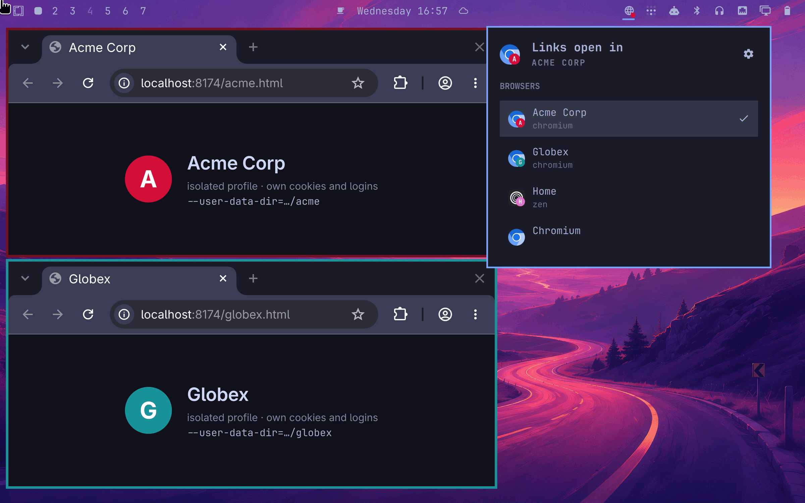
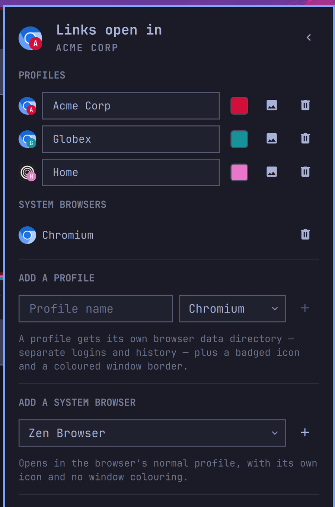

# Browser Switcher

An Omarchy bar widget that decides **where your links open**. Click it, pick a
profile, and every link you open from that point on lands in that browser's
isolated session — separate cookies, separate logins, separate history.



Built for the case where "which browser" really means *whose work am I doing
right now*: a browser for each client, one for yourself, and no more copying
links between windows to get them into the right session.

## Why

Chromium profiles share too much to be a boundary between clients. A separate
`--user-data-dir` is a real one — its own cookie jar, its own keyring entries,
its own process.

The problem is everything else. Isolated profiles mean hand-written desktop
entries, a wrapper script per profile, window rules so you can tell them apart,
and links that still open in whichever browser happens to be the default. This
plugin does all of that, and makes the choice of destination a single click.

## Highlights

**Switching is one click, and instant.** A generated router entry is registered
once as your default browser, so switching writes one small state file instead
of rewriting `mimeapps.list`. It takes effect immediately, for every app, with
nothing to restart.

**Every link source is covered.** Links from GUI apps, links clicked in your
terminal, and CLI tools that read `$BROWSER` travel three different routes with
three different ways of parsing a desktop entry. All three arrive.

**Each profile looks different.** Its own badged icon — your logo composited
onto the browser's own, generated at every size — and its own window border
colour, so an unfocused window still tells you whose session it is.

**Two kinds of entry.** A *profile* is an isolated session the plugin creates
and manages. A *system browser* is just a pointer at a browser as you already
have it installed, for "send this one to plain Firefox" without inventing a
profile for it.

**Everything is reachable from the terminal.** The bar panel is a front end to
a CLI that does the whole job, so it scripts and binds to keys as easily as it
clicks.

**It owns only what it made.** Every generated file is prefixed and bannered,
nothing else is ever written or deleted, and `add` refuses to create a profile
whose window class would collide with an entry it doesn't own.

## Install

```bash
omarchy plugin add https://github.com/sven-strothoff/omarchy-browser-switcher.git --enable
```

That is the whole install. `omarchy plugin add` only clones and enables — it
never runs an install script — so the plugin sets itself up from the panel:

- The CLI is found inside the plugin directory; nothing needs to be on `PATH`.
- Until links actually route here, the panel offers a **Make this the default
  browser** button. Nothing takes over your link handling without that press.
- That step also links `browser-switcher` into `~/.local/bin` for terminal use.

Requires `python3` and `imagemagick`. Run `browser-switcher doctor` any time to
see what is and isn't wired up.

## Using it

**In the bar.** Left-click opens the picker; click an entry to switch.
Right-click opens a window of whatever is selected. Middle-click cycles.

**Configure** (the gear, or `c`) turns the same panel into the management view:
rename a profile in place, pick a colour, choose a logo, remove an entry, add a
profile or a system browser, and set how the bar shows which entry is active.



Profiles and system browsers are listed separately, and a system browser's name
isn't editable — it's the browser's own name, so changing it could only make the
list less accurate.

**From the terminal:**

```bash
browser-switcher list                 # what exists, and what's active
browser-switcher use acme             # switch (id or name)
browser-switcher add --name "Acme" --color '#D20F39' --icon ~/logos/acme.png
browser-switcher add-browser firefox  # plain Firefox, as itself
browser-switcher doctor
```

**From a keybind**, in `~/.config/hypr/bindings.lua`:

```lua
o.bind("SUPER SHIFT", "B", "exec", "omarchy-shell browser-switcher next")
o.bind("SUPER ALT",   "B", "exec", "omarchy-shell browser-switcher configure")
```

## Supported browsers

Everything Omarchy can install, plus preinstalled Chromium and the two extras
Omarchy's own window rules already recognise.

| Browser | Profile isolation | Per-profile window identity |
|---|---|---|
| Chromium, Chrome, Brave, Brave Origin, Edge, Vivaldi | `--user-data-dir` | `--class` |
| Firefox, Zen, LibreWolf | `--profile` | `MOZ_APP_REMOTINGNAME` |

The two families genuinely differ: Firefox ignores `--class` on Wayland, so its
window identity comes from the remoting name instead. Generated Hyprland rules
mirror whichever of Omarchy's two parity rules applies, so a profile window
keeps looking like a browser window rather than falling back to generic opacity.

## What a profile gets

| Thing | Where |
|---|---|
| Isolated browser data | `~/.local/share/browser-switcher/profiles/<id>` |
| Desktop entry | `~/.local/share/applications/browser-switcher-<id>.desktop` |
| Badged icon, 7 sizes | `~/.local/share/icons/hicolor/*/apps/browser-switcher-<id>.png` |
| Window border rule | `~/.local/state/omarchy/toggles/hypr/browser-switcher.lua` |

Window rules need no wiring: Omarchy's stock `hyprland.lua` already auto-loads
every `*.lua` in that state directory, so the rules apply on a clean install
with no config file edited — and uninstalling is one unlink rather than config
surgery.

## Removing a profile

Removing a profile deletes what the plugin generated and **leaves the browsing
data alone** — losing real logins to a misclick would be worse than leaving a
directory behind. The panel says so, and offers a *Delete browsing data too*
toggle that is off every time; the CLI prints where the data was kept.

Re-adding a profile with the same name reuses that directory, so the logins come
straight back.

## Backing out

```bash
omarchy plugin disable sven-strothoff.browser-switcher
browser-switcher uninstall     # restores your previous default browser
```

`uninstall` removes only generated files. Add `--purge` to drop the config and
badges too. Browsing data is never deleted except by `remove --purge`.

## Documentation

- [How it works](docs/internals.md) — the routing indirection, the two browser
  families, the icon pipeline, and why the plugin ships its own `Select`.
- `browser-switcher --help` and `browser-switcher <command> --help`.

## License

MIT
